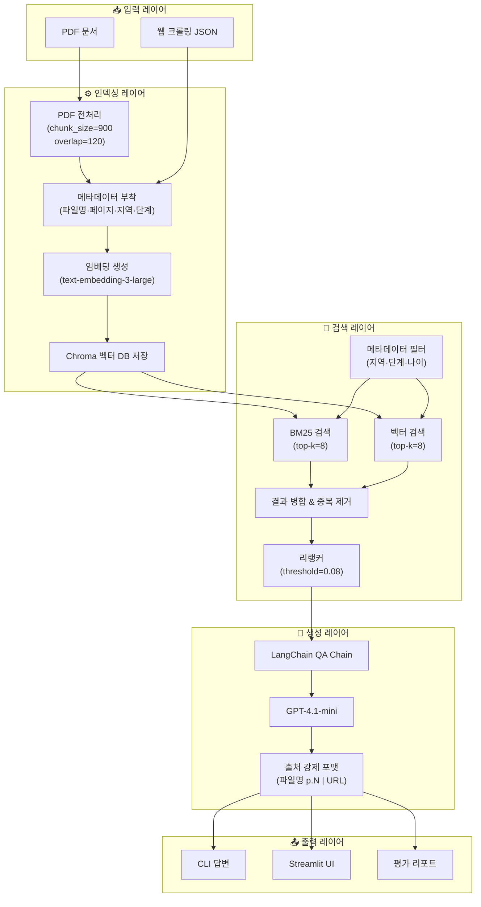
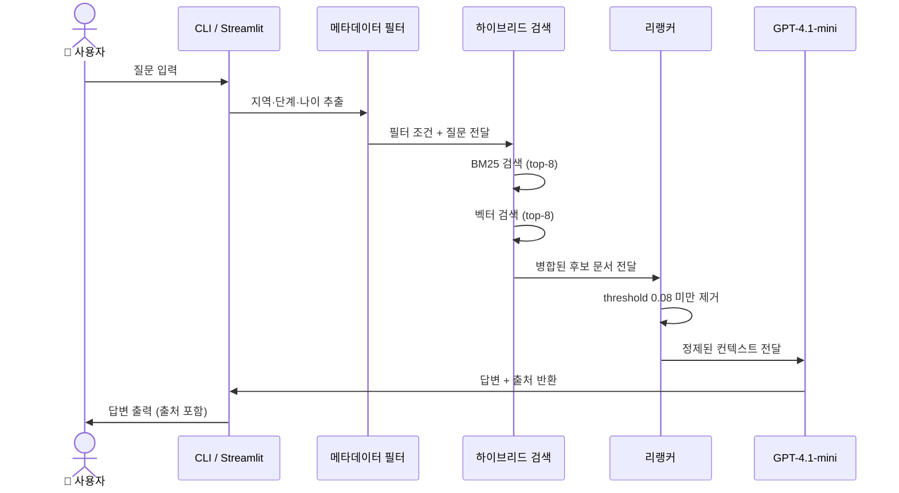

# 🚀 창업지원 문서 기반 RAG 질의응답 시스템

[](https://www.python.org/)
[](https://www.langchain.com/)
[](https://streamlit.io/)
[](https://www.trychroma.com/)
[](https://openai.com/)
[](LICENSE)

> 정부·지자체 창업지원 문서(PDF/웹)를 기반으로 **환각(Hallucination)을 억제**하고  
> **출처를 자동 명시**하는 하이브리드 RAG(Retrieval-Augmented Generation) 시스템입니다.  
> CLI와 Streamlit UI 두 가지 방식으로 질의할 수 있습니다.

---

## 📑 목차

1. [핵심 기능](#-핵심-기능)
2. [시스템 아키텍처](#-시스템-아키텍처)
3. [데이터 흐름](#-데이터-흐름)
4. [기술 스택](#-기술-스택)
5. [폴더 구조](#-폴더-구조)
6. [빠른 시작](#-빠른-시작)
7. [사용 예시](#-사용-예시)
8. [Streamlit 데모](#-streamlit-데모)
9. [웹 수집 데이터 포맷](#-웹-수집-데이터-포맷)
10. [평가 지표](#-평가-지표)
11. [출처 정책](#-출처-정책)
12. [권장 데이터](#-권장-데이터)
13. [참고 사항](#-참고-사항)

---

## ✨ 핵심 기능

| 기능 | 설명 |
|------|------|
| 🔍 **하이브리드 검색** | BM25(키워드) + 벡터 검색을 결합해 검색 정확도를 극대화 |
| 🎯 **경량 리랭킹** | 임계값(threshold) 기반으로 관련도 낮은 결과를 자동 필터링 |
| 🗂️ **메타데이터 필터링** | 질문에서 지역·창업 단계·나이를 자동 추출해 사전 필터 적용 |
| 📌 **출처 강제 표기** | 모든 답변 말미에 `파일명 p.페이지번호 | URL` 형식으로 출처 명시 |
| 🌐 **웹 데이터 수집** | K-Startup·KISED·KOSMES 등 주요 사이트 공고를 자동 크롤링 |
| 📊 **자동 평가** | 통과율·인용률·키워드 적중률 등 정량 지표 자동 산출 |
| 🖥️ **Streamlit UI** | 필터 선택·질의·로그 조회·CSV 다운로드를 웹 UI로 제공 |

---

## 🏗️ 시스템 아키텍처



---

## 🔄 데이터 흐름



---

## 🛠️ 기술 스택

| 영역 | 라이브러리 / 도구 | 버전 |
|------|------------------|------|
| LLM 프레임워크 | LangChain | ≥ 0.3 |
| 언어 모델 | OpenAI GPT-4.1-mini | - |
| 임베딩 | text-embedding-3-large | - |
| 벡터 DB | ChromaDB | ≥ 0.5 |
| 키워드 검색 | rank-bm25 | ≥ 0.2.2 |
| PDF 파싱 | PyPDF, Unstructured | ≥ 5.0 |
| 웹 수집 | BeautifulSoup4, httpx | - |
| 웹 UI | Streamlit | ≥ 1.42 |
| 설정 관리 | python-dotenv | ≥ 1.0 |

---

## 📁 폴더 구조

```
myproject/
├── app.py                        # CLI 진입점 (ask / build-index / eval / run-all)
├── streamlit_app.py              # Streamlit 웹 UI
├── requirements.txt
├── .env.example                  # 환경 변수 템플릿
│
├── src/
│   ├── config.py                 # 전역 설정 (Settings dataclass)
│   ├── data/
│   │   ├── pdf_preprocessor.py   # PDF 로딩 & 청크 분할
│   │   └── web_collectors.py     # 웹 크롤러 (K-Startup 등)
│   ├── ingest/
│   │   └── build_index.py        # 임베딩 생성 & Chroma 저장
│   ├── retrieval/
│   │   └── hybrid_retriever.py   # BM25 + 벡터 하이브리드 검색
│   ├── rag/
│   │   ├── qa_chain.py           # LangChain QA 체인
│   │   └── reranker.py           # 경량 리랭커
│   └── eval/
│       └── run_eval.py           # 자동 평가 시나리오 실행
│
├── data/
│   ├── raw/                      # 원본 PDF & 웹 수집 JSON
│   ├── processed/                # 청크 미리보기 & 질의 로그
│   └── vectorstore/chroma/       # Chroma 벡터 DB 저장 경로
│
└── docs/
    ├── 01_data_preprocessing.md
    ├── 02_system_architecture.md
    ├── 03_test_plan_and_results.md
    └── 04_presentation_material.md
```

---

## ⚡ 빠른 시작

### 1️⃣ 패키지 설치

```bash
pip install -r requirements.txt
```

### 2️⃣ 환경 변수 설정

```bash
cp .env.example .env
# .env 파일을 열어 OPENAI_API_KEY 등을 입력하세요
```

```ini
# .env 주요 항목
OPENAI_API_KEY=sk-...
OPENAI_MODEL=gpt-4.1-mini
EMBEDDING_MODEL=text-embedding-3-large
```

### 3️⃣ 데이터 준비

**방법 A – 직접 PDF 배치**

```
data/raw/ 폴더에 PDF 파일을 복사합니다.
```

**방법 B – 웹 자동 수집 (선택)**

```bash
python app.py collect-web
# → data/raw/web_seed.json 생성
```

### 4️⃣ 인덱스 생성

```bash
python app.py build-index
# PDF + JSON을 함께 임베딩해 Chroma DB에 저장합니다.
```

### 5️⃣ 질의 실행

```bash
python app.py ask "만 39세 서울 거주 예비 창업자가 받을 수 있는 지원금은?"
```

### 6️⃣ 평가 실행

```bash
python app.py eval
```

### 🔁 원클릭 전체 실행

```bash
python app.py run-all   # 수집 → 인덱싱 → 평가를 한 번에 실행
```

---

## 💡 사용 예시

### 단일 조건 질의

```bash
python app.py ask "만 39세 서울 거주 예비 창업자가 받을 수 있는 지원금은?"
```

**출력 예시:**

```
[적용 필터] 지역=서울, 단계=예비창업, 나이=39

예비창업패키지는 만 39세 이하 예비창업자를 대상으로 하며 ...

출처: 예비창업패키지_공고문.pdf p.3 | https://k-startup.go.kr/...
```

### 비교 질의

```bash
python app.py ask "예비창업패키지와 청년창업사관학교 지원 항목 차이점을 알려줘"
```

> 두 프로그램의 지원 대상·금액·의무 사항을 표 형태로 비교해 출력합니다.

---

## 🖥️ Streamlit 데모

```bash
streamlit run streamlit_app.py
```

### 주요 UI 기능

```
┌─────────────────────────────────────────────┐
│  사이드바                    │  메인 영역      │
│  ┌───────────────────────┐  │                 │
│  │ 지역 필터    [서울 ▼] │  │  질문 입력창    │
│  │ 기관 필터    [전체 ▼] │  │                 │
│  │ 지원분야     [전체 ▼] │  │  답변 + 출처    │
│  └───────────────────────┘  │                 │
│  최근 질의 로그 표시         │  출처 미리보기  │
│  CSV 다운로드 버튼           │  (펼치기 가능)  │
└─────────────────────────────────────────────┘
```

- **필터**: 사이드바에서 지역·기관·지원분야를 선택해 검색 범위를 한정
- **질의 로그**: 모든 질의는 `data/processed/query_history.jsonl`에 자동 누적
- **출처 미리보기**: 각 근거 문서의 스니펫과 메타데이터를 펼쳐 확인
- **CSV 내보내기**: 로그를 CSV로 다운로드, `근거 0건` 질문을 자동 분류해 개선 우선순위 파악 가능

---

## 🌐 웹 수집 데이터 포맷

`python app.py collect-web` 실행 시 `data/raw/web_seed.json`이 생성됩니다.

### 수집 대상 사이트

| 사이트 키 | 사이트명 |
|-----------|---------|
| `k-startup` | K-Startup (창업진흥원) |
| `kised` | 한국창업보육협회 (KISED) |
| `kosmes` | 소상공인시장진흥공단 (KOSMES) |
| `modoo` | 중소벤처기업부 모두 |

### 레코드 스키마

```json
{
  "source_site":  "k-startup",          // 출처 사이트 키
  "url":          "https://...",         // 원문 URL
  "title":        "2026 예비창업패키지 모집 공고",
  "body":         "본문 정제 텍스트...",
  "links": [
    { "title": "신청하기", "url": "https://...", "notice_id": "12345" }
  ],
  "notice_id":    "12345",              // 상세 공고 식별자
  "parent_url":   "https://...",        // 목록 페이지 URL
  "deadline":     "2026-04-30",
  "organization": "창업진흥원",
  "support_type": "사업화지원",
  "region":       "서울"
}
```

> **Note**  
> - `links` 필드는 인덱싱 시 별도 문서로 분해되어 공고 제목·URL·ID 기반 검색 정확도를 높입니다.  
> - 로그인·약관·SNS 같은 노이즈 링크는 수집 단계에서 자동 제외됩니다.  
> - K-Startup은 `notice_id`로 상세 공고 페이지를 추가 수집합니다.

---

## 📊 평가 지표

`python app.py eval` 실행 결과에 포함되는 정량 지표입니다.

| 지표 | 설명 |
|------|------|
| `pass_rate` | 사전 정의된 시나리오 중 통과한 비율 |
| `citation_rate` | 답변에 출처(`출처:`)가 포함된 비율 |
| `keyword_hit_ratio` | 시나리오별 필수 키워드가 답변에 등장한 비율 |
| `rerank_ok` | 리랭커를 통과한 문서가 1건 이상 존재하는지 여부 |
| `rerank_top_score` | 리랭커가 부여한 최고 관련도 점수 |

### 내장 테스트 시나리오

```
1. "만 39세 서울 거주 예비 창업자가 받을 수 있는 지원금은?"
   → 검증: 나이/지역/예비창업 조건 반영 여부

2. "예비창업패키지와 청년창업사관학교 지원 항목 차이점을 알려줘"
   → 검증: 비교 구조 답변, 출처 명시 여부

3. "업력 3년 제조업 기업의 정책자금 신청 가능 여부는?"
   → 검증: 업력/업종 조건 정합성
```

---

## 📌 출처 정책

모든 답변은 아래 형식으로 출처를 반드시 표기합니다.

```
출처: <파일명> p.<페이지번호> | <URL (있는 경우)>
```

예시:
```
출처: 예비창업패키지_공고문.pdf p.3 | https://k-startup.go.kr/notice/12345
```

- 컨텍스트에 없는 내용은 답변하지 않습니다 ("모름" 응답 정책).
- 출처가 없는 답변은 평가에서 `citation_rate` 감점 처리됩니다.

---

## 📂 권장 데이터

| 분류 | 데이터 예시 |
|------|-------------|
| 창업지원 공고 | K-Startup 예비·초기창업패키지 공고문 PDF |
| 정책자금 | 중소벤처기업부·소진공 정책자금 융자 가이드북 |
| 지자체 | 서울·경기 등 지자체 창업지원 공고 및 관련 조례 |

---

## 🤝 참고 사항

- **SKN23-3rd-2TEAM** Advanced RAG 운영 방식 중 *리랭커 threshold 게이팅* 아이디어를 경량 버전으로 반영했습니다.
- 검색 결과 진단 지표(필터 적용 여부·리랭커 점수)는 CLI·Streamlit·평가 리포트에 공통으로 노출됩니다.
